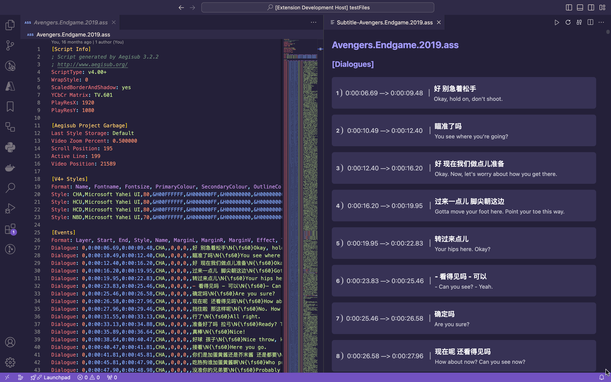
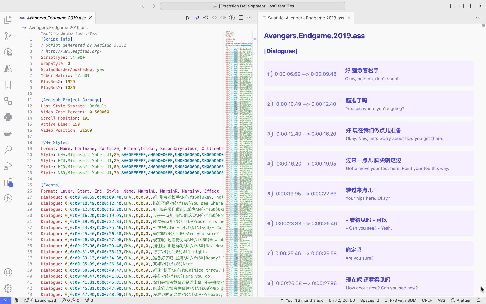
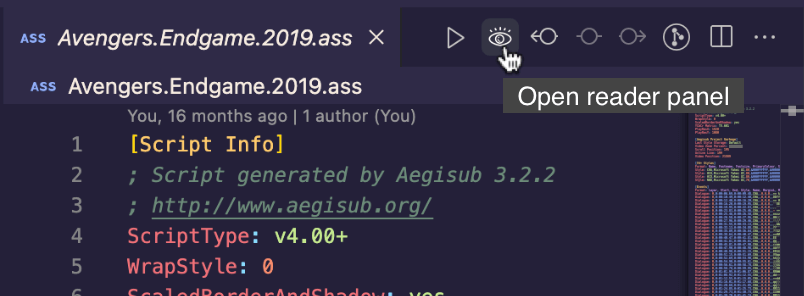
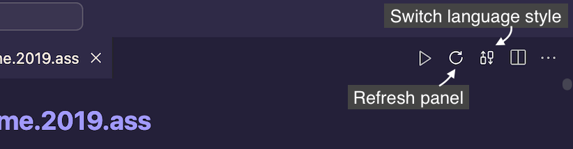

# vscode-subtitle-reader

A tool to enhance the readability of subtitle files.

## Features
* Subtitle files syntaxes highlight (`.ass`, `.ssa`, `.srt`).
* Subtitle files icons support.
* A preview panel with better readability.

### Preview

Support for both light and dark GitHub themes.

 

## Usage

### Extension guide

### Panel guide

## Configuration

- `subtitleReader.autoOpen`: Automatically open the reader panel when an subtitle (.ass, .ssa, .srt) file is opened.
- `subtitleReader.autoClose`: Automatically close the reader panel when other file is opened.
- `subtitleReader.showDialogueLineNumber`: Display line number of dialogues.
- `subtitleReader.style`: Custom style for the reader panel.

